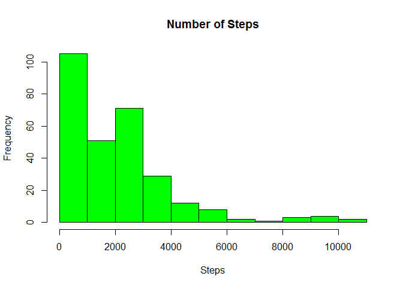
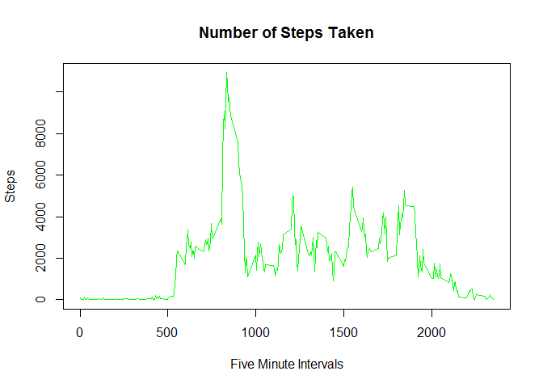
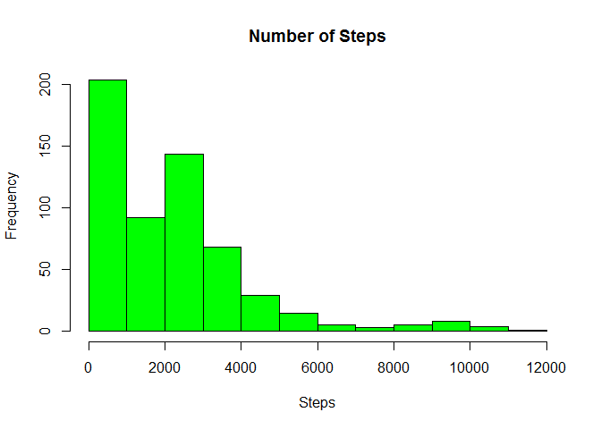
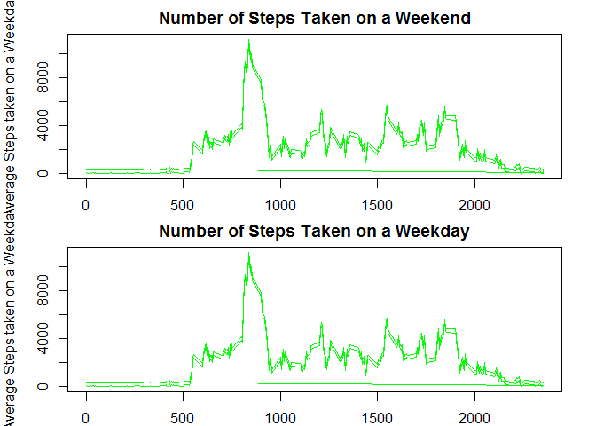

# Reproducible Research Assignment 1
Robert Ben Parkinson  
24-Feb-16  
1: Code for reading Activity Monitor Data


```r
temp <- tempfile()
download.file("https://d396qusza40orc.cloudfront.net/repdata%2Fdata%2Factivity.zip",temp)
con <- unz(temp, "activity.csv")
step <- read.csv(con, sep =",")
unlink(temp)


library(dplyr)
```

```
## 
## Attaching package: 'dplyr'
## 
## The following objects are masked from 'package:stats':
## 
##     filter, lag
## 
## The following objects are masked from 'package:base':
## 
##     intersect, setdiff, setequal, union
```

```r
uni <- unique(step$interval)

df <- data.frame(s.Interval=integer(),
                 s.Total=integer(),
                 s.Mean=integer(),
                 s.Median=integer(),
                 s.NA=character(),
                 stringsAsFactors = FALSE)

for (i in uni){
        x <- subset(step, interval==i)
        y <- sum(is.na(x$steps))
        x <- na.omit(x)
        df[nrow(df)+1,] <- c(i, sum(x$steps), mean(x$steps), median(x$steps), y)
              }

df <- na.omit(df)
```
2: Historgram of the Total Number of Step Taken Each Day


```r
hist(df$s.Total, col = "green", main = "Number of Steps", xlab = "Steps")
```

 

3: Mean and Median Number of Step per day


```r
step2 <- step

step2 <- na.omit(step2)

ux <- unique(step2$date)

xm <- data.frame(date=character(),
                 mean=integer(),
                 median=integer(),
                 stringsAsFactors = FALSE)

for(i in ux){
  
  xm0 <- subset(step2, date == i)
  a <- mean(xm0$steps)
  b <- median(xm0$steps)
  xm[nrow(xm)+1,] <- c(i, a, b)
  
}

c <- mean(step2$steps)
d <- median(step2$steps)

print(c("The total mean steps for the exericese is:", c))
```

```
## [1] "The total mean steps for the exericese is:"
## [2] "37.3825995807128"
```

```r
print(c("The total median steps for the exercise is:", d, "(lazy folks)"))
```

```
## [1] "The total median steps for the exercise is:"
## [2] "0"                                          
## [3] "(lazy folks)"
```

```r
xm
```

```
##          date              mean median
## 1  2012-10-02            0.4375      0
## 2  2012-10-03  39.4166666666667      0
## 3  2012-10-04  42.0694444444444      0
## 4  2012-10-05  46.1597222222222      0
## 5  2012-10-06  53.5416666666667      0
## 6  2012-10-07  38.2465277777778      0
## 7  2012-10-09  44.4826388888889      0
## 8  2012-10-10            34.375      0
## 9  2012-10-11  35.7777777777778      0
## 10 2012-10-12  60.3541666666667      0
## 11 2012-10-13  43.1458333333333      0
## 12 2012-10-14  52.4236111111111      0
## 13 2012-10-15  35.2048611111111      0
## 14 2012-10-16            52.375      0
## 15 2012-10-17  46.7083333333333      0
## 16 2012-10-18  34.9166666666667      0
## 17 2012-10-19  41.0729166666667      0
## 18 2012-10-20          36.09375      0
## 19 2012-10-21  30.6284722222222      0
## 20 2012-10-22  46.7361111111111      0
## 21 2012-10-23  30.9652777777778      0
## 22 2012-10-24  29.0104166666667      0
## 23 2012-10-25  8.65277777777778      0
## 24 2012-10-26  23.5347222222222      0
## 25 2012-10-27  35.1354166666667      0
## 26 2012-10-28  39.7847222222222      0
## 27 2012-10-29  17.4236111111111      0
## 28 2012-10-30          34.09375      0
## 29 2012-10-31  53.5208333333333      0
## 30 2012-11-02  36.8055555555556      0
## 31 2012-11-03  36.7048611111111      0
## 32 2012-11-05  36.2465277777778      0
## 33 2012-11-06           28.9375      0
## 34 2012-11-07  44.7326388888889      0
## 35 2012-11-08  11.1770833333333      0
## 36 2012-11-11  43.7777777777778      0
## 37 2012-11-12  37.3784722222222      0
## 38 2012-11-13  25.4722222222222      0
## 39 2012-11-15 0.142361111111111      0
## 40 2012-11-16  18.8923611111111      0
## 41 2012-11-17  49.7881944444444      0
## 42 2012-11-18  52.4652777777778      0
## 43 2012-11-19  30.6979166666667      0
## 44 2012-11-20  15.5277777777778      0
## 45 2012-11-21  44.3993055555556      0
## 46 2012-11-22  70.9270833333333      0
## 47 2012-11-23  73.5902777777778      0
## 48 2012-11-24  50.2708333333333      0
## 49 2012-11-25  41.0902777777778      0
## 50 2012-11-26  38.7569444444444      0
## 51 2012-11-27  47.3819444444444      0
## 52 2012-11-28  35.3576388888889      0
## 53 2012-11-29          24.46875      0
```

4: Time Series Plot set at Five Minute Intervals


```r
plot(df$s.Interval, df$s.Total, type="l", 
col="green", main = "Number of Steps Taken",
xlab = "Five Minute Intervals",
ylab = "Steps")
```

 

5: The 5-Minute Interval with the Maxium Steps. Top 5


```r
library(dplyr)
maxsteps <- arrange(step, desc(steps))
head(maxsteps, n=5)
```

```
##   steps       date interval
## 1   806 2012-11-27      615
## 2   802 2012-10-12      900
## 3   794 2012-11-27      550
## 4   789 2012-11-19      720
## 5   786 2012-10-15      835
```
6: Strategy for Inputing Missing Data
I took the average number of steps per interval and across the whole study.
I then subsituted in the figure (~37.1 steps) for all of the missing values.
This figures is probally high.


```r
step2 <- step
step2[is.na(step2)] <- mean(df$s.Mean)
```
7: Historgram of the Total Number of Step Taken Each Day With Missing Data


```r
for (i in uni){
  
  x <- subset(step2, interval==i)
  y <- sum(is.na(x$steps))
  x <- na.omit(x)
  df[nrow(df)+1,] <- c(i, sum(x$steps), mean(x$steps), median(x$steps), y)
}

df <- na.omit(df)

hist(df$s.Total, col = "green", main = "Number of Steps", xlab = "Steps")
```

 
His is the Adjusted Mean and Median Number of Step with the extra 37.1 steps per interval added in.
The figures are limited to the first 50.


```r
head(df[, 3:4], n=50)
```

```
##       s.Mean s.Median
## 1  1.7169811        0
## 2  0.3396226        0
## 3  0.1320755        0
## 4  0.1509434        0
## 5  0.0754717        0
## 6  2.0943396        0
## 7  0.5283019        0
## 8  0.8679245        0
## 9  0.0000000        0
## 10 1.4716981        0
## 11 0.3018868        0
## 12 0.1320755        0
## 13 0.3207547        0
## 14 0.6792453        0
## 15 0.1509434        0
## 16 0.3396226        0
## 17 0.0000000        0
## 18 1.1132075        0
## 19 1.8301887        0
## 20 0.1698113        0
## 21 0.1698113        0
## 22 0.3773585        0
## 23 0.2641509        0
## 24 0.0000000        0
## 25 0.0000000        0
## 26 0.0000000        0
## 27 1.1320755        0
## 28 0.0000000        0
## 29 0.0000000        0
## 30 0.1320755        0
## 31 0.0000000        0
## 32 0.2264151        0
## 33 0.0000000        0
## 34 0.0000000        0
## 35 1.5471698        0
## 36 0.9433962        0
## 37 0.0000000        0
## 38 0.0000000        0
## 39 0.0000000        0
## 40 0.0000000        0
## 41 0.2075472        0
## 42 0.6226415        0
## 43 1.6226415        0
## 44 0.5849057        0
## 45 0.4905660        0
## 46 0.0754717        0
## 47 0.0000000        0
## 48 0.0000000        0
## 49 1.1886792        0
## 50 0.9433962        0
```


8: Average Number of Steps taken on a Weekday and Weekend


```r
step2 <- mutate(step2, dayofweek=(weekdays(as.Date(step2$date, "%Y-%m-%d"))))

s.weekend <- subset(step2, dayofweek == c("Saturday","Sunday"))
s.weekday <- subset(step2, dayofweek != c("Saturday","Sunday"))

for (i in uni){
  
  x <- subset(s.weekend, interval==i)
  y <- sum(is.na(x$steps))
  x <- na.omit(x)
  df.weekend <- df
  df.weekend[nrow(df.weekend)+1,] <- c(i, sum(x$steps), mean(x$steps), median(x$steps), y)
}


df.weekend <- na.omit(df.weekend)

for (i in uni){
  
  x <- subset(s.weekday, interval==i)
  y <- sum(is.na(x$steps))
  x <- na.omit(x)
  df.weekday <- df
  df.weekday[nrow(df.weekday)+1,] <- c(i, sum(x$steps), mean(x$steps), median(x$steps), y)
}


df.weekday <- na.omit(df.weekday)


par(mfrow = c(2,1), mar= c(2, 4, 2, 2))
plot(df.weekend$s.Interval, df.weekend$s.Total  , type="l", col="green", 
     main = "Number of Steps Taken on a Weekend",
     xlab = "Five Minute Intervals",
     ylab = "Average Steps taken on a Weekday")

plot(df.weekday$s.Interval, df.weekday$s.Total  , type="l", col="green", 
     main = "Number of Steps Taken on a Weekday",
     xlab = "Five Minute Intervals",
     ylab = "Average Steps taken on a Weekday")
```

 

9: All Code used for this Assignement.


```r
temp <- tempfile()
download.file("https://d396qusza40orc.cloudfront.net/repdata%2Fdata%2Factivity.zip",temp)
con <- unz(temp, "activity.csv")
step <- read.csv(con, sep =",")
unlink(temp)

library(dplyr)

uni <- unique(step$interval)

df <- data.frame(s.Interval=integer(),
                 s.Total=integer(),
                 s.Mean=integer(),
                 s.Median=integer(),
                 s.NA=character(),
                 stringsAsFactors = FALSE)

for (i in uni){
  
        x <- subset(step, interval==i)
        y <- sum(is.na(x$steps))
        x <- na.omit(x)
        df[nrow(df)+1,] <- c(i, sum(x$steps), mean(x$steps), median(x$steps), y)
              }


df <- na.omit(df)

hist(df$s.Total, col = "green", main = "Number of Steps", xlab = "Steps")
```

 

```r
step2 <- step

step2 <- na.omit(step2)

ux <- unique(step2$date)

xm <- data.frame(date=character(),
                 mean=integer(),
                 median=integer(),
                 stringsAsFactors = FALSE)

for(i in ux){
  
  xm0 <- subset(step2, date == i)
  a <- mean(xm0$steps)
  b <- median(xm0$steps)
  xm[nrow(xm)+1,] <- c(i, a, b)
  
}

c <- mean(step2$steps)
d <- median(step2$steps)

print(c("The total mean steps for the exericese is:", c))
```

```
## [1] "The total mean steps for the exericese is:"
## [2] "37.3825995807128"
```

```r
print(c("The total median steps for the exercise is:", d, "(lazy folks)"))
```

```
## [1] "The total median steps for the exercise is:"
## [2] "0"                                          
## [3] "(lazy folks)"
```

```r
xm
```

```
##          date              mean median
## 1  2012-10-02            0.4375      0
## 2  2012-10-03  39.4166666666667      0
## 3  2012-10-04  42.0694444444444      0
## 4  2012-10-05  46.1597222222222      0
## 5  2012-10-06  53.5416666666667      0
## 6  2012-10-07  38.2465277777778      0
## 7  2012-10-09  44.4826388888889      0
## 8  2012-10-10            34.375      0
## 9  2012-10-11  35.7777777777778      0
## 10 2012-10-12  60.3541666666667      0
## 11 2012-10-13  43.1458333333333      0
## 12 2012-10-14  52.4236111111111      0
## 13 2012-10-15  35.2048611111111      0
## 14 2012-10-16            52.375      0
## 15 2012-10-17  46.7083333333333      0
## 16 2012-10-18  34.9166666666667      0
## 17 2012-10-19  41.0729166666667      0
## 18 2012-10-20          36.09375      0
## 19 2012-10-21  30.6284722222222      0
## 20 2012-10-22  46.7361111111111      0
## 21 2012-10-23  30.9652777777778      0
## 22 2012-10-24  29.0104166666667      0
## 23 2012-10-25  8.65277777777778      0
## 24 2012-10-26  23.5347222222222      0
## 25 2012-10-27  35.1354166666667      0
## 26 2012-10-28  39.7847222222222      0
## 27 2012-10-29  17.4236111111111      0
## 28 2012-10-30          34.09375      0
## 29 2012-10-31  53.5208333333333      0
## 30 2012-11-02  36.8055555555556      0
## 31 2012-11-03  36.7048611111111      0
## 32 2012-11-05  36.2465277777778      0
## 33 2012-11-06           28.9375      0
## 34 2012-11-07  44.7326388888889      0
## 35 2012-11-08  11.1770833333333      0
## 36 2012-11-11  43.7777777777778      0
## 37 2012-11-12  37.3784722222222      0
## 38 2012-11-13  25.4722222222222      0
## 39 2012-11-15 0.142361111111111      0
## 40 2012-11-16  18.8923611111111      0
## 41 2012-11-17  49.7881944444444      0
## 42 2012-11-18  52.4652777777778      0
## 43 2012-11-19  30.6979166666667      0
## 44 2012-11-20  15.5277777777778      0
## 45 2012-11-21  44.3993055555556      0
## 46 2012-11-22  70.9270833333333      0
## 47 2012-11-23  73.5902777777778      0
## 48 2012-11-24  50.2708333333333      0
## 49 2012-11-25  41.0902777777778      0
## 50 2012-11-26  38.7569444444444      0
## 51 2012-11-27  47.3819444444444      0
## 52 2012-11-28  35.3576388888889      0
## 53 2012-11-29          24.46875      0
```

```r
plot(df$s.Interval, df$s.Total  , type="l", col="green", 
     main = "Number of Steps Taken",
     xlab = "Five Minute Intervals",
     ylab = "Steps")
```

 

```r
library(dplyr)
maxsteps <- arrange(step, desc(steps))
head(maxsteps, n=5)
```

```
##   steps       date interval
## 1   806 2012-11-27      615
## 2   802 2012-10-12      900
## 3   794 2012-11-27      550
## 4   789 2012-11-19      720
## 5   786 2012-10-15      835
```

```r
step2 <- step
step2[is.na(step2)] <- mean(df$s.Mean)


for (i in uni){
  
  x <- subset(step2, interval==i)
  y <- sum(is.na(x$steps))
  x <- na.omit(x)
  df[nrow(df)+1,] <- c(i, sum(x$steps), mean(x$steps), median(x$steps), y)
}


df <- na.omit(df)

hist(df$s.Total, col = "green", main = "Number of Steps", xlab = "Steps")
```

 

```r
step2 <- mutate(step2, dayofweek=(weekdays(as.Date(step2$date, "%Y-%m-%d"))))

s.weekend <- subset(step2, dayofweek == c("Saturday","Sunday"))
s.weekday <- subset(step2, dayofweek != c("Saturday","Sunday"))

for (i in uni){
  
  x <- subset(s.weekend, interval==i)
  y <- sum(is.na(x$steps))
  x <- na.omit(x)
  df.weekend <- df
  df.weekend[nrow(df.weekend)+1,] <- c(i, sum(x$steps), mean(x$steps), median(x$steps), y)
}


df.weekend <- na.omit(df.weekend)

for (i in uni){
  
  x <- subset(s.weekday, interval==i)
  y <- sum(is.na(x$steps))
  x <- na.omit(x)
  df.weekday <- df
  df.weekday[nrow(df.weekday)+1,] <- c(i, sum(x$steps), mean(x$steps), median(x$steps), y)
}


df.weekday <- na.omit(df.weekday)


par(mfrow = c(2,1), mar= c(2, 4, 2, 2))
plot(df.weekend$s.Interval, df.weekend$s.Total  , type="l", col="green", 
     main = "Number of Steps Taken on a Weekend",
     xlab = "Five Minute Intervals",
     ylab = "Average Steps taken on a Weekday")

plot(df.weekday$s.Interval, df.weekday$s.Total  , type="l", col="green", 
     main = "Number of Steps Taken on a Weekday",
     xlab = "Five Minute Intervals",
     ylab = "Average Steps taken on a Weekday")
```

 

FIN
